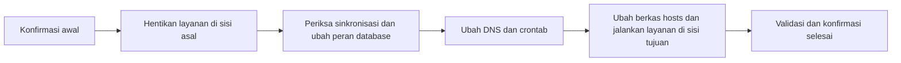

# Orkestrasi Custody Switch Over & Switch Back di Control-M

Repositori ini berisi contoh definisi workflow Control-M untuk perpindahan layanan custody antara **data center utama (DC)** dan **disaster recovery center (DRC)**. Dua XML merupakan hasil ekspor definisi folder, masing-masing berisi 32 job. Nama host, alamat IP, akun `RUN_AS`, dan path lingkungan asli telah diganti dengan placeholder untuk kebutuhan portofolio.

> **Status:** contoh struktur orkestrasi, bukan paket yang siap dijalankan. File skrip shell, konfigurasi DNS, konfigurasi database, dan isi berkas `hosts` tidak disertakan. Semua placeholder harus dipetakan ke lingkungan sendiri sebelum deployment.

## Isi repositori

| File | Fungsi |
| --- | --- |
| [`Custody_Switch_Over.xml`](Custody_Switch_Over.xml) | Mengorkestrasi perpindahan layanan dari DC ke DRC (`SO`). |
| [`Custody_Switch_Back.xml`](Custody_Switch_Back.xml) | Mengorkestrasi pengembalian layanan dari DRC ke DC (`SB`). |

## Cara kerja

Control-M menghubungkan job melalui `INCOND` (prasyarat) dan `OUTCOND` (kondisi yang diterbitkan atau dibersihkan). Karena itu, urutan eksekusi mengikuti dependensi di XML, bukan nomor `JOBISN`. Job `TASKTYPE="Job"` menjalankan skrip melalui `MEMNAME`/`MEMLIB` atau perintah inline. Job `TASKTYPE="Dummy"` dipakai sebagai titik kontrol, konfirmasi operator (`CONFIRM="1"`), atau penanda langkah manual. Beberapa job Dummy masih menyimpan `NODEID`, `MEMLIB`, atau `INSTREAM_JCL` dari definisi ekspor; atribut tersebut **tidak berarti** skripnya akan dieksekusi sebagai job biasa. Tinjau tipe job saat setup.

Alur tingkat tinggi kedua folder:

| Tahap | Switch Over (DC → DRC) | Switch Back (DRC → DC) |
| --- | --- | --- |
| Aplikasi | Stop BANCS, NAP, dan SI di DC; kemudian start di DRC. | Stop BANCS, NAP, dan SI di DRC; kemudian start di DC. |
| Database | Periksa sequence/gap, ubah peran primary/standby, dan tangani MRP sesuai titik konfirmasi DBA. | Periksa sequence/gap dan kembalikan peran primary/standby ke DC. |
| Routing dan jadwal | Konfirmasi perpindahan DNS, matikan crontab di DC, aktifkan di DRC, lalu sesuaikan berkas `hosts`. | Konfirmasi DNS kembali ke DC, matikan crontab di DRC, aktifkan di DC, lalu sesuaikan berkas `hosts`. |
| Kendali | Job `Cfm_*` menunggu persetujuan/tindakan PIC; `Dummy_Finish_*` menandai akhir alur. | Pola kendali yang sama berlaku untuk folder `SB`. |

Tabel ini adalah ringkasan fungsi. Detail urutan, cabang paralel, dan titik tunggu yang berlaku adalah `INCOND`/`OUTCOND` pada masing-masing XML.

## Placeholder yang harus diisi

| Placeholder | Arti / lokasi penggunaan |
| --- | --- |
| `HOST_DC_APP`, `HOST_DC_DB` | Nama/alias agent untuk aplikasi dan database di DC; muncul di `NODEID` dan deskripsi. |
| `HOST_DRC_APP`, `HOST_DRC_DB` | Nama/alias agent untuk aplikasi dan database di DRC. |
| `IP_DC_APP`, `IP_DC_DB`, `IP_DRC_APP`, `IP_DRC_DB` | IP masing-masing host dalam deskripsi job. |
| `IP_SERVICE` | IP layanan yang dicari oleh perintah `grep` setelah perubahan berkas `hosts`. |
| `IP_CONTROL_M`, `CONTROL_M_SERVER` | Metadata host versi dan server Control-M dari ekspor; sesuaikan atau hasilkan ulang sesuai instalasi. |
| `USER_APP`, `USER_DB`, `USER_PRIVILEGED`, `USER_DUMMY` | Akun `RUN_AS` untuk job aplikasi, database, perubahan berkas sistem, dan Dummy. |
| `USER_EXPORTER` | Identitas pembuat/pengubah pada metadata ekspor. |
| `/path/to/app/services`, `/path/to/db/services` | Direktori skrip layanan aplikasi dan database (`MEMLIB`). |
| `/path/to/db/failover`, `/path/to/db/compare` | Direktori skrip failover database dan pembanding sequence. |
| `/path/to/hosts_SO_disable`, `/path/to/hosts_SO_enable`, `/path/to/hosts_SB_disable`, `/path/to/hosts_SB_enable` | Berkas sumber untuk perubahan `hosts` pada masing-masing arah. |
| `/path/to/system_hosts` | Berkas `hosts` target di host terkait. |

Nama berkas skrip pada `MEMNAME` (misalnya `startBancsApp.sh`) dipertahankan untuk menunjukkan maksud job. Pastikan berkas dengan nama tersebut benar-benar tersedia pada agent yang dituju. Nilai di `DESCRIPTION` juga perlu disesuaikan, tetapi tidak dipakai Control-M sebagai alamat eksekusi. Jangan menaruh password, token, atau private key di XML maupun repositori.

## Tahapan penggunaan

1. **Persiapan:** tetapkan rencana failover/failback, PIC aplikasi/DBA/DNS, jendela perubahan, kriteria keberhasilan, dan rencana rollback. Pastikan replikasi database dan kondisi standby telah diperiksa oleh DBA.
2. **Pemetaan lingkungan:** buat salinan XML di luar repositori publik; ganti seluruh placeholder, periksa `DATACENTER`, `NODEID`, `RUN_AS`, `MEMLIB`, dan `INSTREAM_JCL`. Periksa pula jadwal, tanggal, serta aturan konfirmasi folder/job.
3. **Verifikasi artefak:** sediakan semua skrip sesuai `MEMNAME`, direktori kerja, berkas sumber `hosts`, dan hak akses akun pada agent. Uji perintah shell serta mekanisme rollback di lingkungan nonproduksi.
4. **Simulasi:** impor ke workspace uji, tinjau setiap dependensi dan job Dummy, jalankan validasi Control-M, lalu lakukan uji terkontrol. Perhatikan job yang berpotensi mengubah DNS, crontab, peran database, dan berkas sistem.
5. **Eksekusi:** gunakan folder `Custody_Switch_Over` saat memindahkan layanan ke DRC. Gunakan `Custody_Switch_Back` saat mengembalikannya ke DC, setelah status sistem disetujui PIC. Pantau output job, kondisi, dan langkah konfirmasi sampai job akhir selesai.

## Setup ke Control-M

1. Pastikan Control-M/Server, Control-M/Agent di setiap host, dan izin untuk mengelola folder tersedia. Daftarkan atau cocokkan alias agent dengan `NODEID` yang sudah diisi.
2. Siapkan akun `RUN_AS` yang valid pada agent dan hak akses minimum yang diperlukan. Job penggantian berkas sistem memerlukan hak khusus sesuai kebijakan lingkungan; atur lewat mekanisme otorisasi Control-M/OS yang berlaku.
3. Tempatkan skrip di direktori `MEMLIB` pada host yang benar. Sesuaikan `INSTREAM_JCL` untuk job pembanding dan perubahan `hosts`; pastikan path sumber, path target, serta IP validasi sesuai lingkungan.
4. Impor XML ke **Planning/Workspace** pada instalasi yang masih mendukung impor XML, atau gunakan `ctm deploy <file.xml>` jika versi Automation API yang dipakai mendukung format ekspor XML ini. Lakukan satu folder per kali dan periksa hasil validasi. Perintah deploy dapat menimpa definisi bernama sama, jadi gunakan workspace/lingkungan uji dan tinjau perubahan sebelum menerapkannya.
5. Buka setiap job di workspace: periksa tipe `Job`/`Dummy`, `CONFIRM`, agent, akun, skrip, kalender/scheduling, serta pasangan `INCOND`/`OUTCOND`. Validasi lalu **check in** sesuai alur persetujuan organisasi. Setelah itu baru lakukan order/run terkontrol dan pantau di Monitoring.

Panduan resmi BMC: [Deploy service dan dukungan XML pada Automation API](https://docs.bmc.com/xwiki/bin/view/Control-M-Orchestration/Control-M/workloadautomation/Control-M-Automation-API/ctmapi921/Services/Deploy-service/). BMC telah [mendepresiasi format XML](https://docs.bmc.com/xwiki/bin/view/Control-M-Orchestration/Control-M/Announcements/Deprecation-and-End-of-Support/XML-Format-Deprecation/) dan menyarankan JSON untuk workflow baru; kompatibilitas impor/deploy harus diperiksa terhadap versi Control-M yang digunakan.

## Batasan contoh

- XML ini mendokumentasikan orkestrasi, bukan implementasi skrip operasional. Keberhasilan job tergantung skrip, hak akses, agent, dan prosedur manual yang disiapkan terpisah.
- Job konfirmasi dan perpindahan database/DNS perlu keputusan PIC. Jangan menganggap status `OK` pada Dummy sebagai bukti bahwa tindakan eksternal sudah selesai.
- Placeholder sengaja membuat definisi tidak siap dijalankan. Simpan nilai lingkungan nyata dalam mekanisme konfigurasi internal yang terkontrol.
